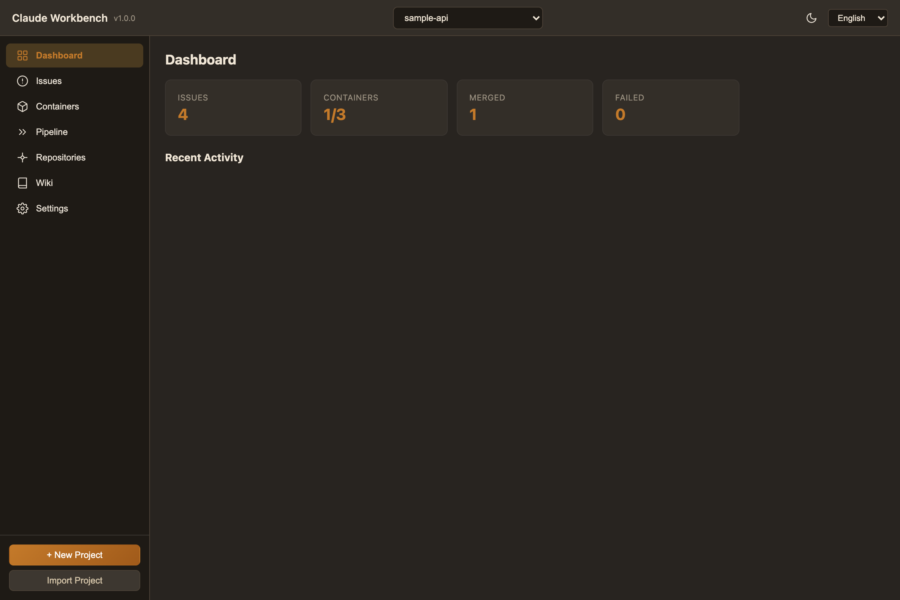
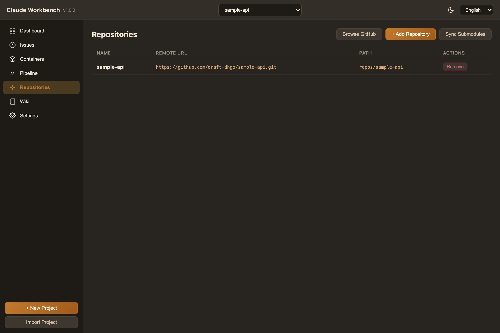
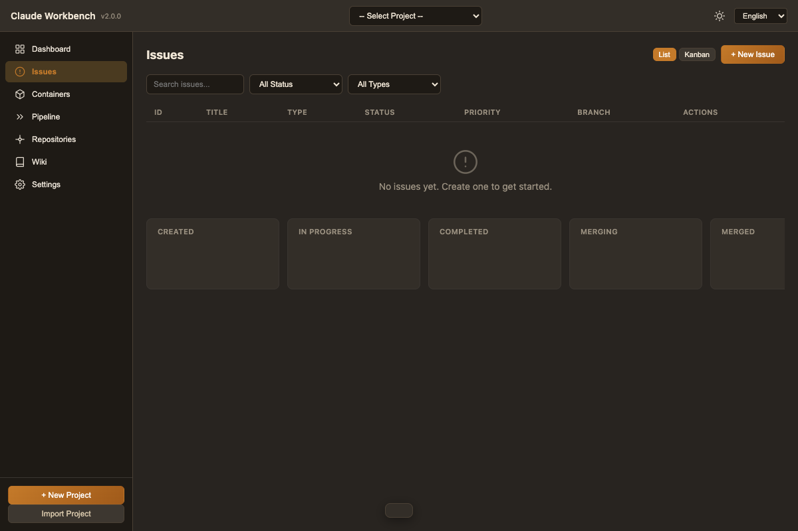
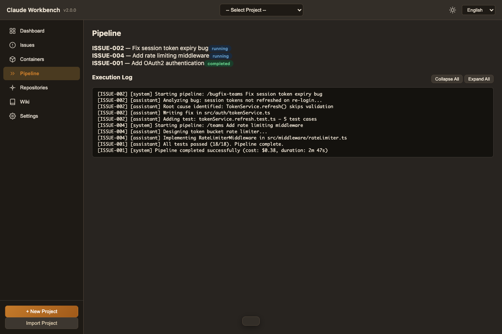
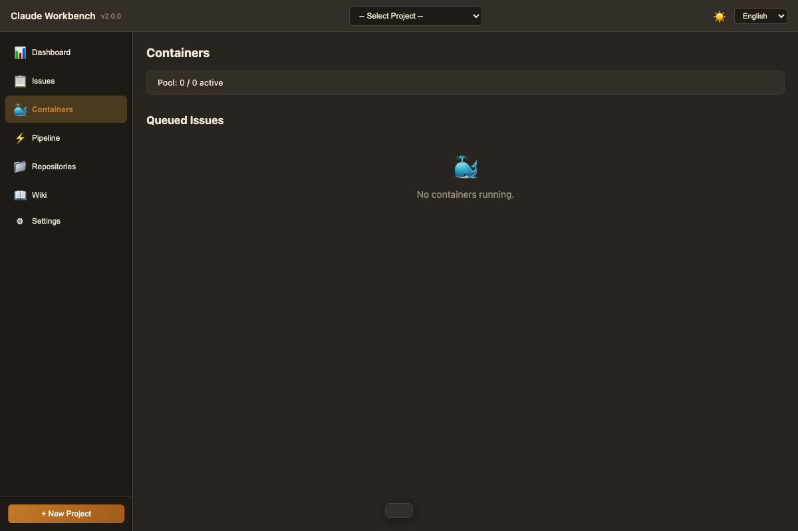
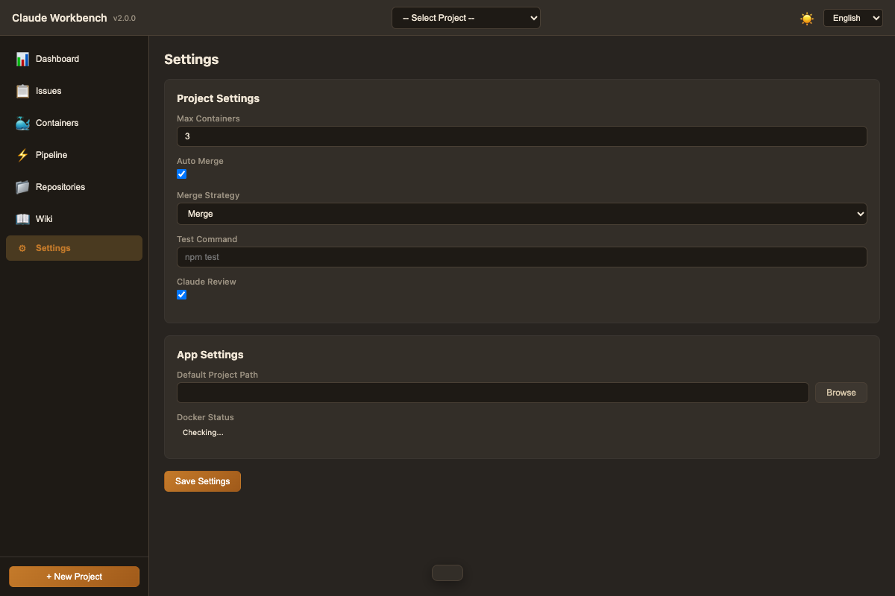

<p align="center">
  
</p>

<h1 align="center">Claude Workbench</h1>

<p align="center">
  Claude Code로 개발 이슈를 자동 처리하는 데스크톱 앱.<br/>
  이슈 등록 → Start → Claude가 코드 작성 → 확인 후 Merge. 끝.
</p>

<p align="center">
  
  
  
  
</p>

---

## 30초 요약

```
1. 프로젝트 만들기  →  이슈 관리용 git repo가 자동 생성됨
2. dev repo 추가    →  서브모듈로 연결 (backend, frontend 등)
3. 이슈 등록        →  "로그인 API 구현해줘" + /teams 커맨드
4. Start 클릭       →  컨테이너에서 Claude Code가 알아서 코드 작성
5. 완료되면 확인    →  브랜치 변경사항 리뷰 후 Merge 클릭
6. 끝               →  baseBranch에 merge + push 완료
```

---

## 설치

```bash
git clone https://github.com/draft-dhgo/claude-workbench.git
cd claude-workbench
npm install
npm run build:ts
npm start
```

Docker 설치하면 격리된 컨테이너에서 실행됩니다. 없어도 로컬 worktree 모드로 동작합니다.

---

## 사용법: 처음부터 끝까지

### Step 1. 프로젝트 만들기

앱을 켜면 사이드바 하단에 두 버튼이 보입니다:

- **+ New Project** — 새 프로젝트 생성
- **Import Project** — 기존 프로젝트 가져오기

#### 새 프로젝트

1. **+ New Project** 클릭
2. 프로젝트 이름 입력 (예: `my-saas-app`)
3. Remote URL 입력 (선택사항 — GitHub에 미리 만든 빈 repo URL)
4. **Create** 클릭

자동으로 `~/claude-workbench-data/projects/my-saas-app-issues/` 에 이슈 관리용 git repo가 생성됩니다. 안에 `.cwb/project-settings.json`, `.claude/`, `wiki/`, `issues/` 등이 셋업됩니다.

#### 기존 프로젝트 가져오기

팀원이 이미 만든 프로젝트가 있다면:

1. **Import Project** 클릭
2. git URL 붙여넣기 (예: `https://github.com/myorg/my-saas-app-issues.git`)
3. **Import** 클릭

자동으로 clone → 서브모듈 동기화 → 이슈 로드. 끝.



---

### Step 2. dev repo 연결하기

실제 코드가 있는 repo들을 서브모듈로 연결합니다.

1. 사이드바에서 **Repositories** 클릭
2. **+ Add Repository** 클릭
3. git URL 입력 (예: `https://github.com/myorg/backend-api.git`)
4. 이름 입력 (예: `backend-api`)

이슈 repo 안의 `repos/backend-api/`에 서브모듈로 추가됩니다. 여러 repo를 추가할 수 있습니다 (backend, frontend, shared-lib 등).

**Sync Submodules** 버튼은 `git submodule update --init --recursive`를 실행합니다.



---

### Step 3. 이슈 등록하기

1. 사이드바에서 **Issues** 클릭
2. **+ New Issue** 클릭
3. 폼 작성:

| 필드 | 설명 | 예시 |
|------|------|------|
| **Title** | 이슈 제목 | `Add OAuth2 authentication` |
| **Description** | 상세 설명 | `Google, GitHub OAuth 지원 필요` |
| **Type** | `Feature` 또는 `Bugfix` | `Feature` |
| **Priority** | `Low` / `Medium` / `High` / `Critical` | `High` |
| **Base Branch** | 작업 시작점 + merge 대상 | `main` |
| **Pipeline Command** | `/teams` (신규 기능) 또는 `/bugfix-teams` (버그 수정) | `/teams` |
| **Pipeline Arguments** | Claude에게 전달할 작업 지시 | `JWT 기반 OAuth2 로그인 구현` |
| **Labels** | 분류 태그 (쉼표 구분) | `auth, backend` |

4. **Create** 클릭 → 이슈가 `Created` 상태로 등록됨

이슈 목록은 **리스트** (기본) 또는 **칸반** 뷰로 볼 수 있습니다.



---

### Step 4. 이슈 실행하기

이슈 목록에서 원하는 이슈의 **Start** 버튼을 클릭합니다.

그러면 이런 일이 일어납니다:

```
1. 컨테이너 풀에서 빈 컨테이너 할당 (없으면 새로 생성)
2. 각 dev repo에 issue/ISSUE-001 브랜치 생성 (baseBranch에서 분기)
3. Claude Code가 /teams 또는 /bugfix-teams 파이프라인 실행
4. 완료되면 이슈 상태 → "Completed"
```

**여러 이슈를 동시에 Start할 수 있습니다.** `Max Containers` 설정만큼 병렬 실행되고, 초과하면 큐에서 대기합니다.

실행 중인 파이프라인 로그는 **Pipeline** 페이지에서 실시간으로 볼 수 있습니다.



---

### Step 5. 결과 확인 후 Merge

이슈가 `Completed` 상태가 되면:

1. 브랜치의 변경사항을 확인
2. 이슈 목록에서 **Merge** 버튼 클릭
3. 앱이 자동으로:
   - 각 dev repo에서 `issue/ISSUE-XXX` → `baseBranch` 병합
   - remote에 push
   - 이슈 상태 → `Merged`

실패하면 `Failed` 상태가 되고, **Retry** 버튼으로 재시도할 수 있습니다.

#### 이슈 상태 흐름

```
Created  ──Start──▶  In Progress  ──완료──▶  Completed  ──Merge──▶  Merged
                          │                                            │
                        Abort                                        Close
                          │                      Retry                 │
                          ▼                        ▲                   ▼
                       Created ◀──────────────  Failed              Closed
```

| 버튼 | 언제 | 동작 |
|------|------|------|
| **Start** | `Created` 상태 | 컨테이너 할당 + 파이프라인 실행 |
| **Abort** | `In Progress` 상태 | 실행 중단, Created로 복귀 |
| **Merge** | `Completed` 상태 | baseBranch에 merge + push |
| **Retry** | `Failed` 상태 | Created로 리셋, 재시도 가능 |

---

### 컨테이너 모니터

사이드바에서 **Containers** 클릭하면 풀 상태를 볼 수 있습니다.

- 풀 현황: `2/5 active`
- 각 컨테이너: ID, 상태, 할당된 이슈
- 대기 중인 이슈 큐
- 개별 컨테이너 강제 종료 가능

Docker가 설치되어 있으면 격리된 Docker 컨테이너에서 실행되고, 없으면 로컬 git worktree로 폴백합니다.



---

### 설정

사이드바에서 **Settings** 클릭.

| 설정 | 설명 | 기본값 |
|------|------|--------|
| **Max Containers** | 이 프로젝트의 동시 실행 컨테이너 수 | 3 |
| **Test Command** | 파이프라인 실행 시 테스트 명령 | (없음) |
| **Data Root Path** | 모든 프로젝트/컨테이너 데이터 저장 경로 | `~/claude-workbench-data/` |
| **Docker Status** | Docker 설치 여부 + 버전 | 자동 감지 |



---

### Wiki

파이프라인이 실행될 때마다 이슈 repo의 `wiki/` 디렉토리에 산출물이 저장됩니다:

```
wiki/
  requirements/    PRDs, specs, test designs
  tdd/             TDD 사이클 리포트
  deploy/          빌드/배포 리포트
  views/           Wiki 대시보드 (HTML)
```

**Wiki** 페이지에서 로컬 HTTP 서버를 띄우고 인앱 패널로 볼 수 있습니다.

---

### 다른 PC에서 사용하기

1. Claude Workbench 설치
2. **Import Project** 클릭
3. 이슈 repo URL 붙여넣기
4. **Import** 클릭

자동으로 clone + 서브모듈 동기화 + 이슈 로드. 끝.

이슈 변경사항은 자동으로 git commit + push됩니다. 프로젝트 선택 시 자동으로 pull합니다.

---

### 한국어 / English

헤더 우측 드롭다운에서 언어를 전환할 수 있습니다.

---

## Architecture

<details>
<summary>펼치기</summary>

### 데이터 구조

```
~/claude-workbench-data/
  projects/
    my-saas-app-issues/           # 이슈 관리 repo
      .cwb/project-settings.json  # 프로젝트 설정 (git으로 공유)
      .gitmodules                 # 서브모듈 설정
      repos/                     # dev repo 서브모듈
        backend-api/
        frontend-web/
      issues/
        manifest.json            # 이슈 DB
        details/ISSUE-001.md
      .claude/commands/          # Claude Code 커맨드
      .claude/skills/            # Claude Code 스킬
      CLAUDE.md
      wiki/                      # 파이프라인 산출물
  containers/                    # 컨테이너 worktree
  devcontainers/                 # Docker 이미지 캐시
```

### 이슈 처리 흐름

```
User clicks "Start"
  → ContainerPoolService.acquireContainer()
    → Docker container or local worktree
  → GitService.createWorktree() for each dev repo
    → issue/ISSUE-XXX branch from baseBranch
  → PipelineExecutorService.execute()
    → Claude Code SDK or CLI with /teams or /bugfix-teams
  → Issue status → completed
  → User clicks "Merge"
    → MergeService.merge() for each dev repo
    → GitService.push()
    → Issue status → merged
  → ContainerPoolService.releaseContainer()
```

### 서비스 계층

| Service | 역할 |
|---------|------|
| `ProjectStore` | 프로젝트 CRUD, JSON 영속화 |
| `IssueService` | 이슈 생명주기 (manifest.json + git commit/push) |
| `ContainerPoolService` | Docker 컨테이너 풀 관리 |
| `DockerService` | Docker CLI 래퍼 |
| `GitService` | git 명령 통합 (branch/worktree/submodule/merge) |
| `PipelineExecutorService` | Claude Code SDK/CLI 실행 |
| `PipelineOrchestratorService` | 이슈 전체 처리 오케스트레이션 |
| `ProjectManagerService` | 프로젝트 생성/임포트/대시보드 |
| `SettingsStore` | 앱 설정 영속화 |
| `MergeService` | git merge + 충돌 감지/해결 |

### 소스 구조

```
src/
  main/           # Electron 메인 프로세스
    services/     # 비즈니스 로직 (11개 서비스)
    handlers/     # IPC 핸들러 (7개 파일)
    constants/    # 파이프라인 커맨드 + 스킬 정의
    templates/    # devcontainer 템플릿
  shared/types/   # 공유 타입 정의
  renderer/       # UI (HTML + CSS + JS)
  preload/        # 보안 IPC 브릿지
```

</details>

---

## Tech Stack

| | |
|---|---|
| **Runtime** | Electron 28 |
| **Language** | TypeScript 5.9 |
| **Tests** | Jest (22 suites, 364 tests) |
| **AI** | @anthropic-ai/claude-agent-sdk |
| **Containers** | Docker devcontainers |
| **i18n** | English / Korean |

---

## Development

```bash
npm run typecheck    # 타입 체크
npm test             # 테스트 실행
npm run dev          # 개발 모드 실행
npm run build        # 배포용 빌드
```

---

## License

MIT
