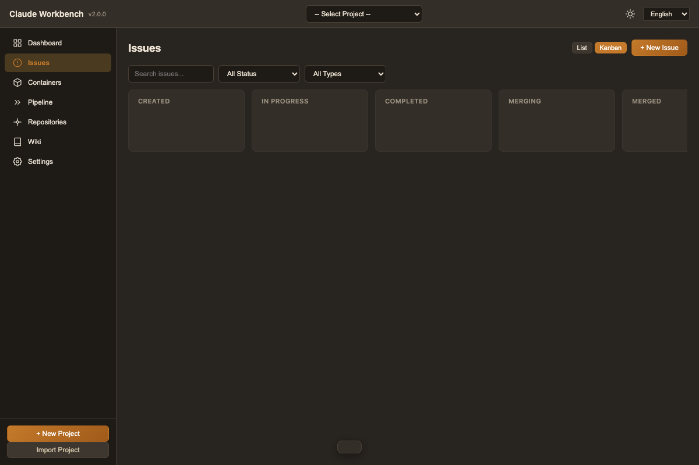

<p align="center">
  
</p>

<h1 align="center">Claude Workbench</h1>

<p align="center">
  Project-centric development automation platform powered by Claude Code.<br/>
  Manage issues, run AI pipelines, and auto-merge &mdash; all from one desktop app.
</p>

<p align="center">
  
  
  
  
</p>

---

## Table of Contents

- [Getting Started](#getting-started)
- [User Guide](#user-guide)
  - [Creating a Project](#1-creating-a-project)
  - [Adding Repositories](#2-adding-repositories-submodules)
  - [Creating Issues](#3-creating-issues)
  - [Running Issues (Pipeline Execution)](#4-running-issues-pipeline-execution)
  - [Container Monitor](#5-container-monitor)
  - [Pipeline Logs](#6-pipeline-logs)
  - [Wiki Viewer](#7-wiki-viewer)
  - [Settings](#8-settings)
- [Cloning a Project on Another Machine](#cloning-a-project-on-another-machine)
- [Supported Languages](#supported-languages)
- [Architecture](#architecture)
- [Project Structure](#project-structure)
- [Tech Stack](#tech-stack)
- [Development](#development)
- [License](#license)

---

## Getting Started

### Prerequisites

| Requirement | Version | Notes |
|---|---|---|
| [Node.js](https://nodejs.org/) | 18+ | Required |
| [Docker](https://www.docker.com/) | 20+ | Optional (for isolated dev containers) |
| npm | 9+ | Comes with Node.js |

### Installation

```bash
git clone https://github.com/draft-dhgo/claude-workbench.git
cd claude-workbench
npm install
```

### Running the App

```bash
npm run build:ts   # Compile TypeScript
npm start          # Launch the app

# Or in development mode (with DevTools)
npm run dev
```

### Building for Distribution

```bash
npm run build      # Creates DMG (macOS), NSIS (Windows), AppImage (Linux)
```

---

## User Guide

### 1. Creating a Project

A **Project** is the central unit of work. It consists of:
- An **issue-tracking repo** (created automatically) with `.cwb/project-settings.json` for portable settings
- One or more **dev repos** added as git submodules

To create a new project:

1. Click **+ New Project** in the sidebar
2. Enter a project name
3. (Optional) Enter a remote URL if you have a remote repo ready (e.g., `https://github.com/org/my-project-issues.git`)
4. Click **Create**

The app will:
- Create a git repository at `<data-root>/projects/<project-name>-issues/`
- Scaffold the directory structure (`.cwb/`, issues, wiki, .claude config, skills, commands)
- If remote URL was provided: `git remote add origin` + initial push
- Make an initial commit and register the project

To import an existing project:

1. Click **Import Project** in the sidebar
2. Enter a **git remote URL** (will auto-clone) or select a **local directory**
3. Click **Import**

The app will:
- Clone the repo (if URL) or read the local path
- Read `.cwb/project-settings.json` to load project name, settings, dev repos
- Sync submodules automatically
- Register the project and load all issues


### 2. Adding Repositories (Submodules)

Navigate to the **Repositories** page from the sidebar.

1. Click **+ Add Repository**
2. Enter the git remote URL (e.g., `https://github.com/myorg/backend-api.git`)
3. Enter a name (e.g., `backend-api`)
4. The app adds it as a git submodule under `repos/<name>` in the issue repo

To sync submodules after cloning:
- Click **Sync Submodules** to run `git submodule update --init --recursive`


### 3. Creating Issues

Navigate to the **Issues** page. You can view issues in **List** (default) or **Kanban** mode.

1. Click **+ New Issue**
2. Fill in the form:
   - **Title**: Short description of the work
   - **Description**: Detailed context
   - **Type**: `Feature` or `Bugfix`
   - **Priority**: `Low`, `Medium`, `High`, or `Critical`
   - **Base Branch**: The branch to start from (default: `main`)
   - **Target Branch**: The branch to merge into after completion (default: `main`)
   - **Pipeline Command**: `/teams` for new features, `/bugfix-teams` for bug fixes
   - **Pipeline Arguments**: Detailed instructions for Claude Code (what to implement/fix)
   - **Labels**: Tags for categorization (comma-separated)
3. Click **Create**


#### Issue Statuses

| Status | Meaning |
|--------|---------|
| **Created** | Issue defined, waiting to be started |
| **In Progress** | Container allocated, Claude Code pipeline running |
| **Completed** | Pipeline done, waiting for user merge approval |
| **Merging** | User approved, merge in progress |
| **Merged** | Changes merged to baseBranch and pushed |
| **Failed** | Pipeline or merge failed (can retry) |
| **Closed** | Issue resolved and archived |

#### Kanban View

Toggle to **Kanban** view to see issues organized by status columns. Drag-and-drop is visible at a glance.



### 4. Running Issues (Pipeline Execution)

Click **Start** on any issue with status `Created`.

The system will:
1. **Acquire a container** from the pool (or create a new one if under the limit)
2. **Create branches** in each dev repo: `issue/ISSUE-XXX` based on the base branch
3. **Run the pipeline command** (`/teams` or `/bugfix-teams`) via Claude Code
4. **Transition to `Completed`** — pipeline work done, waiting for your review

**After completion**, review the branch changes and click **Merge** to approve:
1. The app merges `issue/ISSUE-XXX` → `baseBranch` in each dev repo
2. Pushes the merged result to remote
3. Cleans up the issue branch and releases the container

If the container pool is full, the issue is queued and will start automatically when a container becomes available.

| Action | When |
|--------|------|
| **Start** | Issue is `Created` — begins pipeline execution |
| **Abort** | Issue is `In Progress` — stops execution |
| **Merge** | Issue is `Completed` — approves and merges to baseBranch |
| **Retry** | Issue `Failed` — resets to Created for another attempt |

### 5. Container Monitor

Navigate to the **Containers** page to see the dev container pool.

- **Pool status bar**: Shows active containers vs. max allowed
- **Container cards**: Each card shows container ID, status, assigned issue
- **Queued Issues**: Issues waiting for an available container
- **Destroy**: Manually stop and remove a container


#### Container Modes

| Mode | Description |
|------|-------------|
| **Docker** | Full isolation via Docker devcontainer with `--dangerously-skip-permissions` |
| **Local** | Fallback when Docker is unavailable; uses git worktrees on the host filesystem |

### 6. Pipeline Logs

Navigate to the **Pipeline** page to view real-time execution logs.

- Logs are color-coded: assistant (green), system (blue), errors (red)
- **Collapse All / Expand All** controls for managing log visibility
- Logs are streamed in real-time via IPC
- Each pipeline shows the associated issue ID and current status


### 7. Wiki Viewer

Navigate to the **Wiki** page.

- Click **Start Server** to host the wiki artifacts on a local HTTP server (port 8080-8099)
- Click **Open Panel** to view the wiki in an in-app side panel
- The wiki includes all pipeline artifacts: requirements, PRDs, SDDs, test designs, TDD logs, deploy reports

Each issue's pipeline execution generates artifacts stored in the wiki directory of the issue repo.

### 8. Settings

Navigate to the **Settings** page.


#### Project Settings

| Setting | Description | Default |
|---------|-------------|---------|
| **Max Containers** | Maximum concurrent dev containers for this project | 3 |
| **Test Command** | Custom test command (e.g., `npm test`) | (none) |

#### App Settings

| Setting | Description |
|---------|-------------|
| **Data Root Path** | Where all project repos, containers, and caches are stored (`~/claude-workbench-data/` by default) |
| **Docker Status** | Shows Docker availability and version |

---

## Setting Up on Another Machine

Just one step:

1. Open Claude Workbench
2. Click **Import Project**
3. Paste the issue repo git URL (e.g., `https://github.com/myorg/my-project-issues.git`)
4. Click **Import**

That's it. The app auto-clones, syncs submodules, reads `.cwb/project-settings.json`, and loads all issues.

### Automatic Sync

- **On project select**: auto-pulls latest changes from remote (`git pull --rebase --autostash`)
- **On issue change**: auto-commits and pushes to remote
- **Submodules**: auto-synced on project select and import
- **Settings**: stored in `.cwb/project-settings.json` inside the repo, synced via git

No manual sync needed. Works offline too — changes are pushed when connection is available.

---

## Supported Languages

The app supports English and Korean (한국어). Switch languages using the dropdown in the header.

---

## Architecture

### Data Root Structure

```
~/claude-workbench-data/          # AppSettings.dataRootPath
  projects/                       # All issue repos
    my-saas-app-issues/
    mobile-client-issues/
  containers/                     # Dev container worktrees
    <container-id>/
  devcontainers/                  # Docker image cache
```

### Issue Repo Structure

```
my-project-issues/              # Git repository
  .git/
  .gitmodules                   # Submodule config
  .cwb/
    project-settings.json       # Portable project settings (synced via git)
  repos/                        # Dev repos as submodules
    backend-api/
    frontend-web/
  issues/
    manifest.json               # Issue database (auto-managed)
    details/
      ISSUE-001.md              # Detailed description per issue
  .claude/
    commands/                   # Claude Code slash commands
    skills/                     # Claude Code skills
  CLAUDE.md                     # Claude Code workspace config
  wiki/
    requirements/               # REQ-*.md
    prd/                        # PRD documents
    specs/                      # SDD documents
    tests/                      # Test designs
    tdd/                        # TDD cycle reports
    deploy/                     # Deploy reports
    bugfix/                     # Bug fix records
    bugs/                       # Bug tracker
    knowledge/                  # Project knowledge
    mockups/                    # HTML mockups
    views/index.html            # Wiki Viewer dashboard
```

### Issue Lifecycle Flow

```
User creates Issue (status: created)
    |
User clicks "Start"
    |
PipelineOrchestratorService.processIssue()
    |
1. ACQUIRE CONTAINER
    |-- Pool has idle container? Use it
    |-- Pool < max? Create new Docker container
    |-- Pool == max? Queue issue (wait)
    |
2. SETUP BRANCHES
    |-- For each dev repo: git worktree add -b issue/ISSUE-XXX
    |-- Issue status -> in-progress
    |
3. RUN PIPELINE
    |-- Claude Code: /teams or /bugfix-teams
    |-- OAuth authentication (no API key needed)
    |-- Real-time log streaming
    |-- Issue status -> completed
    |
4. USER REVIEWS & APPROVES MERGE
    |-- User checks branch changes
    |-- Clicks "Merge" button
    |-- git merge issue/ISSUE-XXX -> baseBranch + push
    |-- Issue status -> merged
    |
5. CLEANUP
    |-- Remove worktrees, delete branches
    |-- Container -> idle, return to pool
    |-- Process next queued issue
```

### Service Layer

| Service | Responsibility |
|---------|---------------|
| `ProjectStore` | Project CRUD, JSON persistence |
| `IssueService` | Issue lifecycle in issue repo (manifest.json + git) |
| `ContainerPoolService` | Docker container pool (acquire/release/destroy) |
| `DockerService` | Docker CLI wrapper (build/create/exec) |
| `GitService` | Centralized git operations (branch/worktree/submodule/merge) |
| `PipelineExecutorService` | Claude Code SDK/CLI execution |
| `PipelineOrchestratorService` | Full issue lifecycle orchestration |
| `ProjectManagerService` | Active project state, dashboard, scaffolding |
| `SettingsStore` | App settings persistence |
| `MergeService` | Git merge with conflict detection/resolution |
| `WikiHostService` | Local HTTP server for wiki artifacts |

### IPC Channels

| Domain | Channels |
|--------|----------|
| Project | `project:list`, `project:create`, `project:clone`, `project:set-active`, ... |
| Issue | `issue:list`, `issue:create`, `issue:start`, `issue:abort`, `issue:retry`, ... |
| Container | `container:pool-status`, `container:destroy`, `container:set-max`, ... |
| Pipeline | `pipeline:status`, `pipeline:abort` |
| Settings | `app:settings:get`, `app:settings:update`, `app:docker:check` |
| Wiki | `wiki-host:start`, `wiki-host:stop`, `wiki-panel:open`, ... |

---

## Project Structure

```
src/
  main/
    index.ts                           # App entry, IPC registration
    window.ts                          # BrowserWindow config
    services/
      projectStore.ts                  # Project CRUD + persistence
      issueService.ts                  # Issue lifecycle
      containerPoolService.ts          # Container pool management
      dockerService.ts                 # Docker CLI wrapper
      gitService.ts                    # Centralized git operations
      pipelineOrchestratorService.ts   # Issue lifecycle orchestration
      pipelineExecutorService.ts       # Claude Code execution
      projectManagerService.ts         # Project management
      settingsStore.ts                 # App settings
      mergeService.ts                  # Git merge operations
      wikiHostService.ts               # Wiki HTTP server
      wikiPanelService.ts              # Wiki BrowserView panel
    handlers/                          # IPC handler files
    constants/                         # Pipeline commands & skills
    templates/                         # Devcontainer templates
  shared/types/
    project.ts, issue.ts, container.ts, settings.ts, ipc.ts, models.ts
  renderer/
    index.html                         # Sidebar layout (7 pages)
    styles.css                         # Dark/light theme CSS
    scripts/app.js                     # Router + all page logic
    locales/en.json, ko.json           # i18n
  preload/index.ts                     # Secure IPC bridge
```

---

## Tech Stack

| Component | Technology |
|-----------|-----------|
| Runtime | Electron 28 |
| Language | TypeScript 5.9 |
| Testing | Jest + ts-jest (22 suites, 364 tests) |
| Packaging | electron-builder |
| Security | Context Isolation + Preload Script |
| AI SDK | @anthropic-ai/claude-agent-sdk |
| Containers | Docker devcontainers |
| i18n | English / Korean |

---

## Development

```bash
# Type check
npm run typecheck

# Run tests
npm test

# Run tests with coverage
npx jest --coverage

# Build TypeScript
npm run build:ts

# Start in dev mode
npm run dev
```

---

## License

MIT
