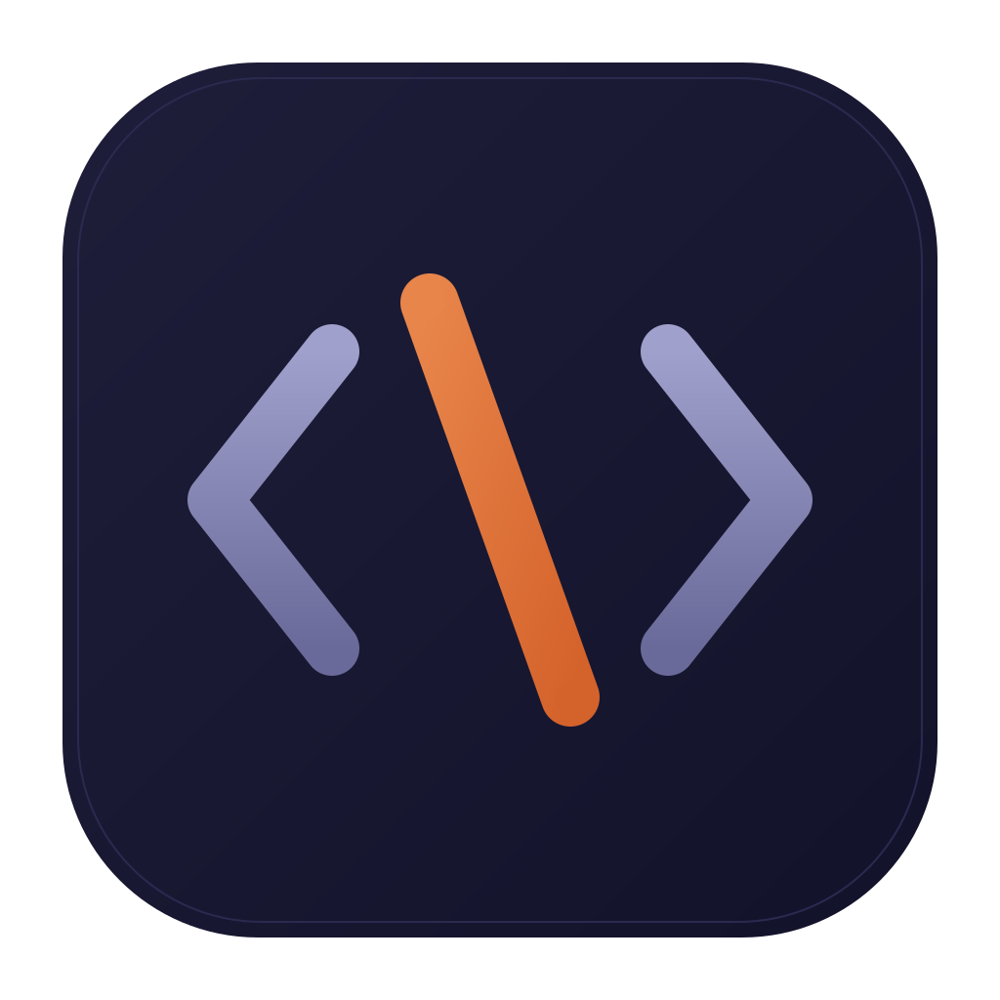
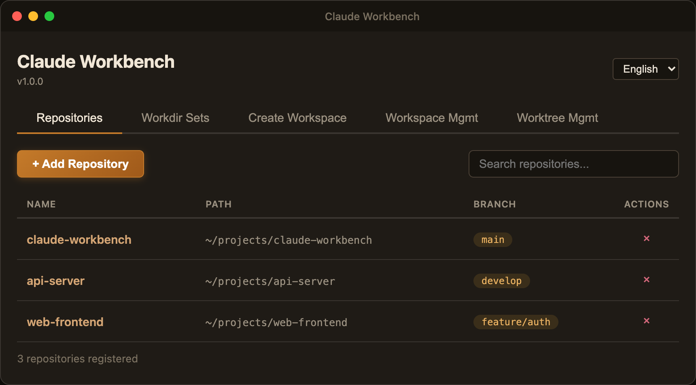
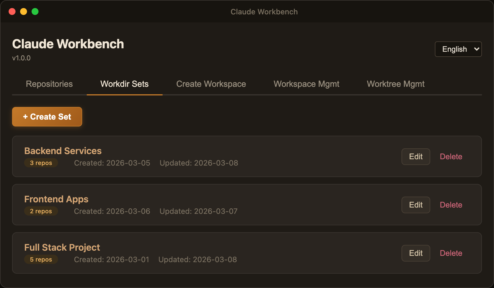
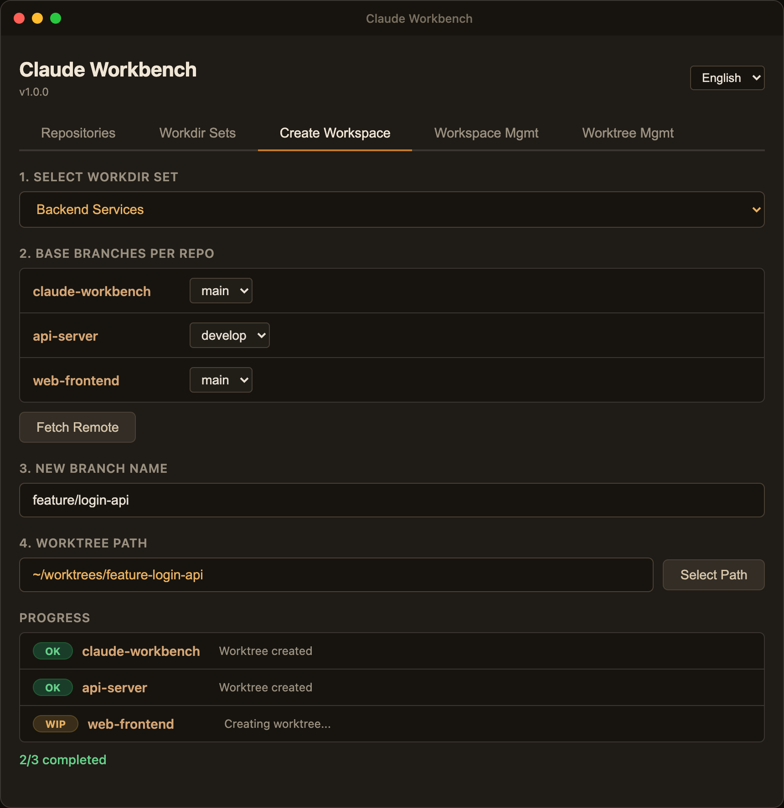
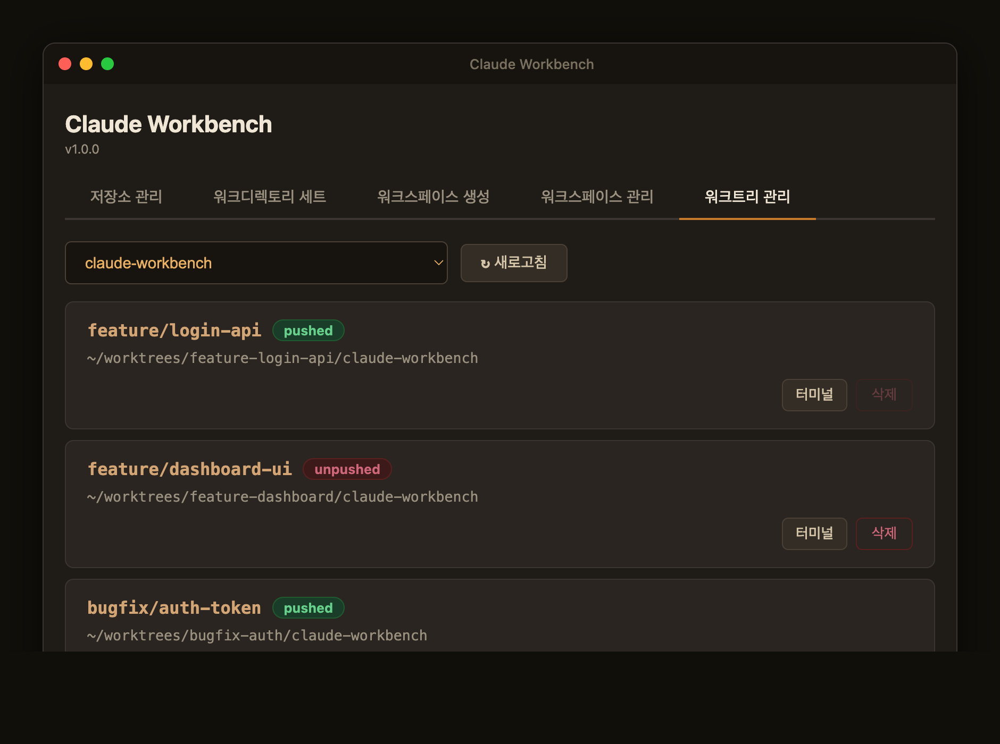

<p align="center">
  
</p>

<h1 align="center">Claude Workbench</h1>

<p align="center">
  Claude Code-powered development workstation &mdash; Git worktree management and scrum pipeline in one desktop app.
</p>

<p align="center">
  
  
  
</p>

---

## Repository Management

Register local Git repositories, check current branches, and find them quickly with search.



## Workdir Sets

Group multiple repositories into a single set. Useful for microservice projects where you work across several repos simultaneously.



## Workspace Creation

Select a set and create worktrees across all repositories with the same branch name in one shot. Track progress in real time.



## Worktree Management

View the worktree list per repository and manage deletions based on push status. Shows a warning when deleting an unpushed branch.



---

## Claude Code Commands

Run Claude Code inside a workspace and automate the scrum development pipeline with slash commands.

```bash
cd ~/worktrees/feature-login-api
claude
```

| Command | Description | Usage |
|---------|-------------|-------|
| `/teams` | Run team development pipeline | Automates the full flow: requirements → design → implementation → deploy |
| `/add-req` | Register a new requirement | Adds a new requirement to `wiki/requirements/` |
| `/add-bug` | Register a new bug | Registers a bug in `wiki/bugs/README.md` |
| `/bugfix-teams` | Run bug-fix pipeline | Automates analysis → fix → test flow for a registered bug |

```bash
# Register a requirement then run the pipeline
> /add-req
> "JWT token-based auth needs to be implemented for the login API"

> /teams
> "Implement REQ-001 login API"

# Register a bug then run the fix pipeline
> /add-bug
> "Refresh token is not renewed on login"

> /bugfix-teams
> "Fix BUG-001"
```

Each pipeline step saves its artifact to the `wiki/` directory automatically:

```
wiki/
├── requirements/    # Requirement definitions
├── prd/             # Product requirement documents
├── specs/           # Design documents (SDD)
├── tests/           # Test design
├── tdd/             # TDD cycle reports
├── deploy/          # Build/deploy reports
├── bugfix/          # Bug fix analysis
├── bugs/            # Bug tracker
├── mockups/         # UI mockups (HTML)
├── knowledge/       # Project knowledge base
└── views/           # Wiki Viewer (dashboard)
```

---

## Wiki Viewer

A Wiki Viewer is included to browse all pipeline artifacts in your browser. The **cycle-based view** lets you track the pipeline progress for each requirement (REQ) and bug (BUG) at a glance.

### Dashboard

Displays Dev Cycle and Bug Cycle cards in a grid. See the completion status of each cycle (5 required stages: PRD → SDD → Tests → TDD → Deploy) and a Mockup Gallery.


### Traceability Matrix

Tracks each requirement from REQ through PRD → SDD → Tests → TDD → Deploy → Mockup → Bugfix in a matrix view.


### Cycle Detail & Document Viewer

Click a cycle in the sidebar to visualize pipeline stages and open each stage's document directly. Markdown is rendered and mockups (HTML) are embedded as iframes.

### How to Run

Start a local server from the `wiki/` directory of your workspace and open it in a browser.

```bash
# From workspace root
npx serve wiki -p 3000

# Open in browser
open http://localhost:3000/views/index.html
```

Or with Python:

```bash
python3 -m http.server 3000 -d wiki
```

---

## Getting Started

### Prerequisites

- [Node.js](https://nodejs.org/) 18+
- npm 9+

### Installation

```bash
git clone https://github.com/draft-dhgo/claude-workbench.git
cd claude-workbench
npm install
```

### Development

```bash
# Compile TypeScript then start the app
npm run build:ts
npm start

# Development mode (NODE_ENV=development)
npm run dev

# Type check
npm run typecheck

# Tests
npm test
```

### Build (Packaging)

```bash
npm run build
```

Build output is placed in the `build/` directory. (macOS DMG, Windows NSIS, Linux AppImage)

---

## Project Structure

```
claude-workbench/
├── src/
│   ├── main/              # Electron main process
│   │   ├── index.ts        # App entry point
│   │   ├── window.ts       # Window configuration
│   │   ├── handlers/       # IPC handlers
│   │   ├── services/       # Business logic
│   │   └── constants/      # Constants
│   ├── preload/            # Context bridge (secure IPC)
│   ├── renderer/           # UI (HTML/CSS/JS)
│   │   ├── locales/        # i18n locale files (en.json, ko.json)
│   │   └── scripts/        # Renderer scripts
│   └── shared/types/       # Shared type definitions
├── assets/                 # App icons (PNG, ICNS, ICO)
├── __tests__/              # Jest tests
└── docs/                   # Documentation & screenshots
```

---

## Command Queue

Queue multiple Claude Code commands and execute them sequentially. Built on the `@anthropic-ai/claude-agent-sdk`, commands run with full permission bypass and auto-retry on rate limits.

- **FIFO queue**: enqueue `/add-req`, `/teams`, `/bugfix-teams`, `/add-bug` commands
- **Rate limit retry**: exponential backoff (30s → 5min) with countdown timer
- **Abort**: cancel a running command mid-execution via AbortController
- **Dequeue**: remove pending commands before they start
- **Real-time logs**: IPC-based status updates and execution logs in the UI

---

## Tech Stack

- **Runtime**: Electron 28
- **Language**: TypeScript 5.9
- **Testing**: Jest + ts-jest
- **Packaging**: electron-builder
- **Security**: Context Isolation + Preload Script
- **AI SDK**: @anthropic-ai/claude-agent-sdk

---

## License

MIT
